## Spotify-Desktop-Clone
This is a Java desktop music player application inspired by Spotify, created using NetBeans GUI Builder (Swing). It allows users to:  
Register and log in securely with hashed passwords,  
Browse and play songs by different artists stored in a MySQL database,  
View artist information and song details,  
Experience a Spotify-like modern interface.

## Key Features
User authentication with password hashing for secure login,  
User-friendly UI with Spotify-inspired design,  
Play and pause audio files stored locally,  
Displays song titles and artist names,  
Designed using NetBeans drag-and-drop GUI builder (Swing),  
Uses MySQL Server to store user credentials, song, and artist data.

## Technologies Used
Java (JDK 17 or higher recommended),  
Java Swing (NetBeans GUI Builder),  
Java Sound API for audio playback,  
MySql for storing songs paths and artists and users information,  
JDBC for connecting Java with MySQL,  
Password hashing algorithms for secure user authentication,  
NetBeans IDE for development.

## How to Run
Clone this repository:  
Use git clone https://github.com/Rohan-Waseem/Spotify-Desktop-Clone.git.  
Use java jdk 17,  
Set up MySQL Server: Create the required database and tables as defined in the project.  
Insert your song and artist data.  
The database includes a users table with hashed passwords for authentication.  
Update database connection details in your Java project files if needed.  
Connect Libraries given in lib folder,  
Open the project in NetBeans IDE.  
Ensure Java 17 or higher is installed.  
Run the project from NetBeans.  

## Future Improvements
Add playlist creation feature,  
Implement search functionality by song or artist,  
Integrate with Spotify Web API for real streaming data,    
Use Cloud Services such as Firebase or AWS,  
Support additional audio formats (e.g. mp3 with external libraries).

## License
This project is open-source for learning purposes. Feel free to fork and enhance it.

## Author
Rohan Waseem

Java Developer | Learning by Building Real Projects

## Note
This project uses locally stored audio files and retrieves song, artist, and user authentication data from a MySQL database. Passwords are securely hashed before storage for safe authentication. For full Spotify integration, an API connection and OAuth authentication are required (advanced implementation).
## Project Structure
Make sure project has these files:  
Spotify-Desktop-Clone/  
├── src/  
├── nbproject/  
│   ├── build-impl.xml  
│   ├── genfiles.properties  
│   ├── project.properties  
│   └── project.xml  
├── lib/  
│   ├── mysql-connector-java-8.0.xx.jar  
│   └── otherlibraries  
├── build.xml  
├── manifest.mf  

## Screenshots

Here is the main UI of the Spotify Java App:

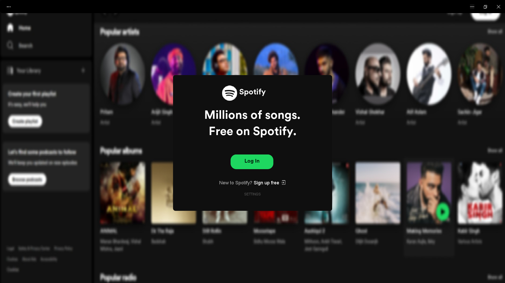
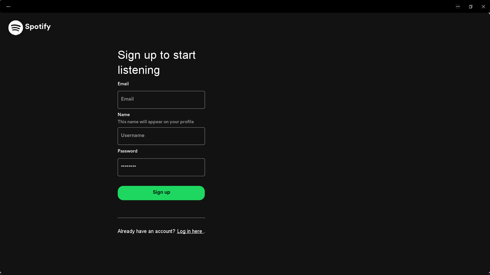
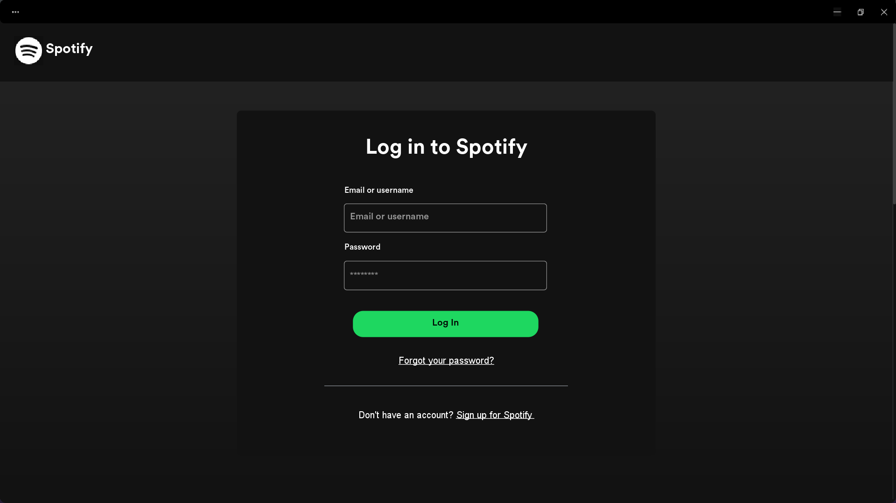
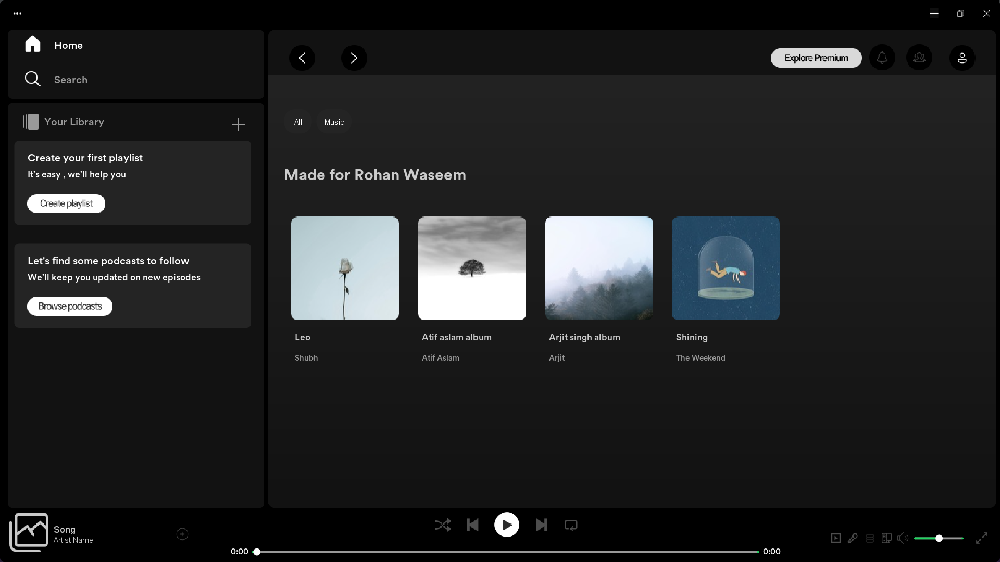
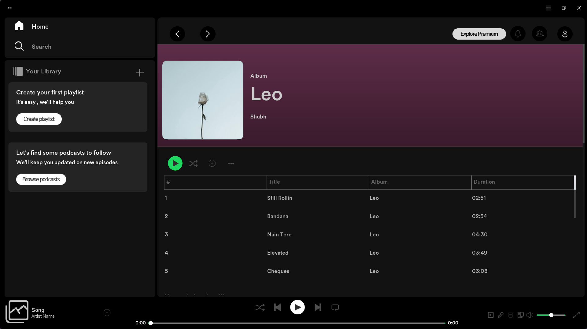
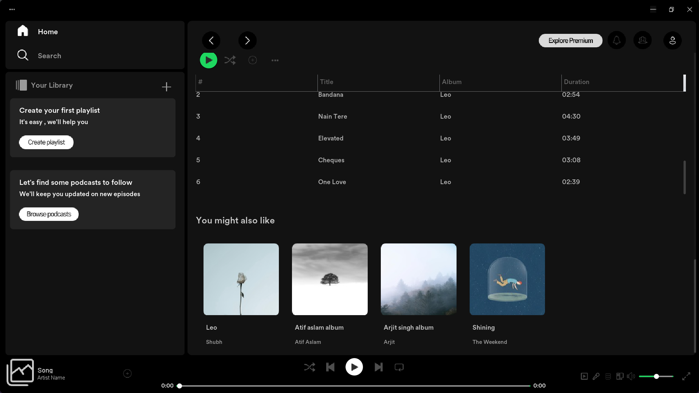
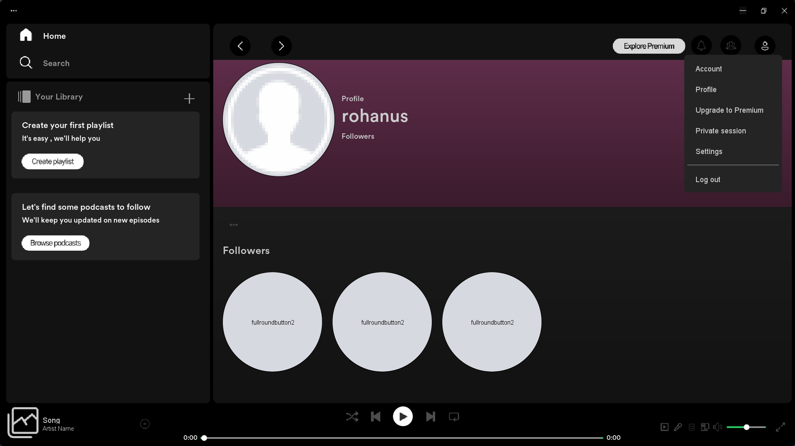
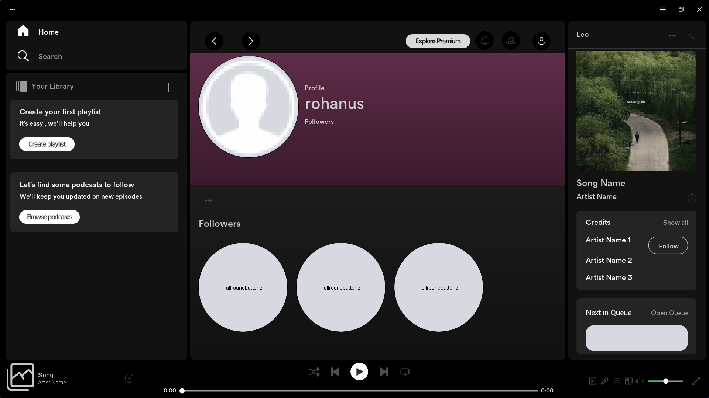
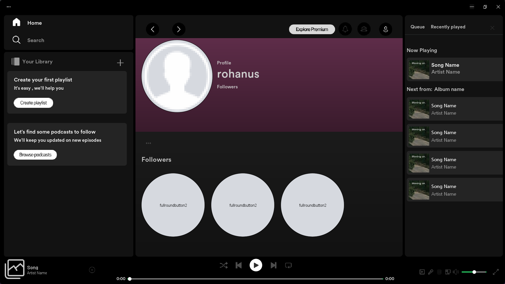
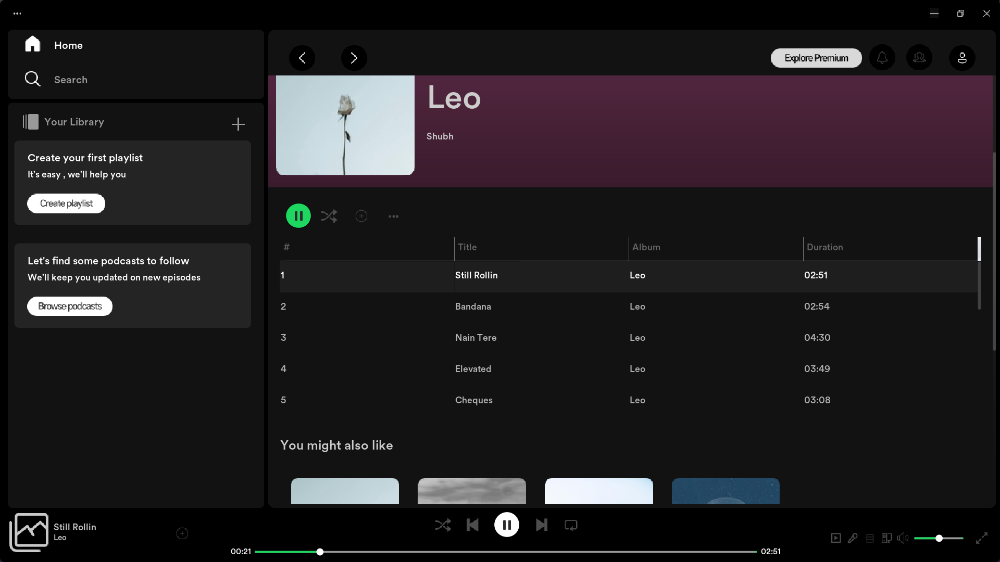
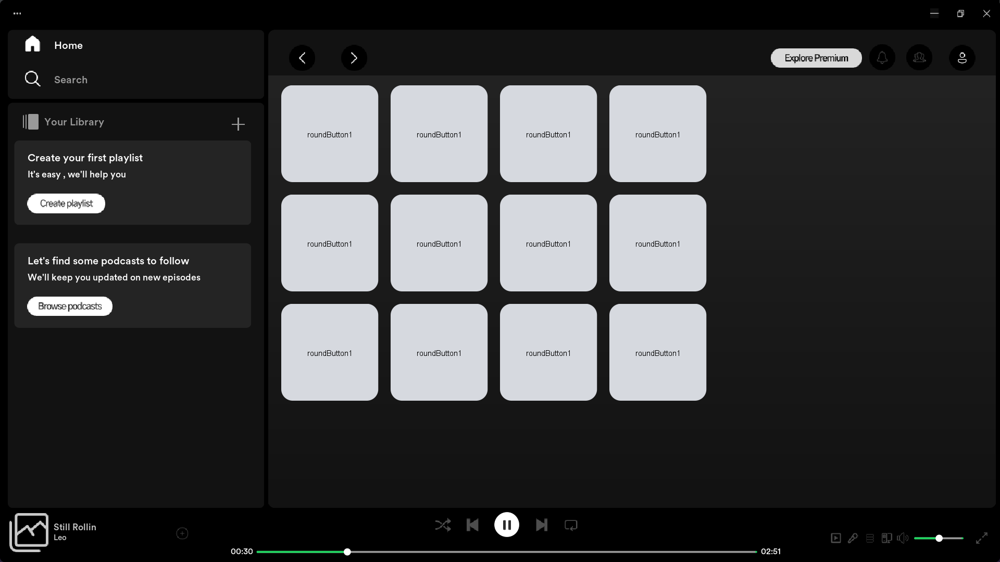
Make Database as:
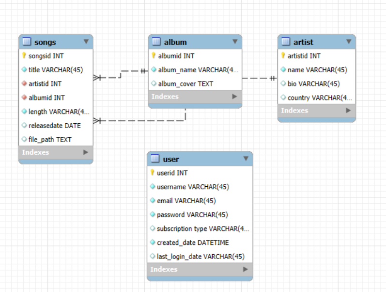